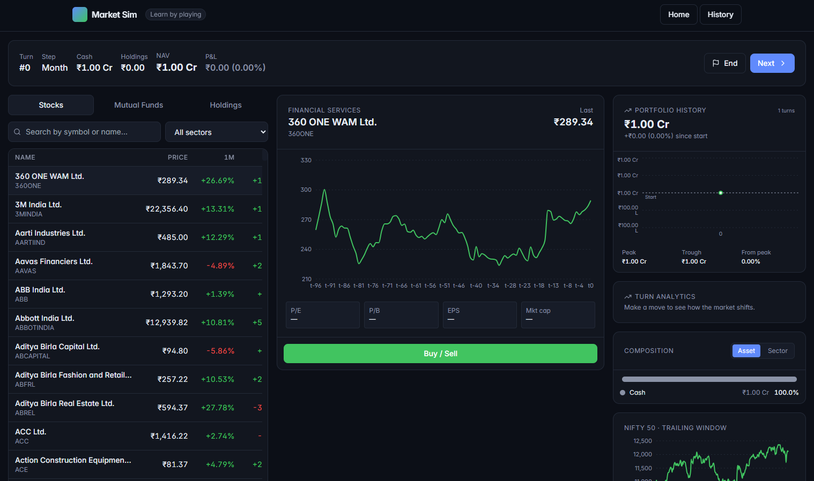
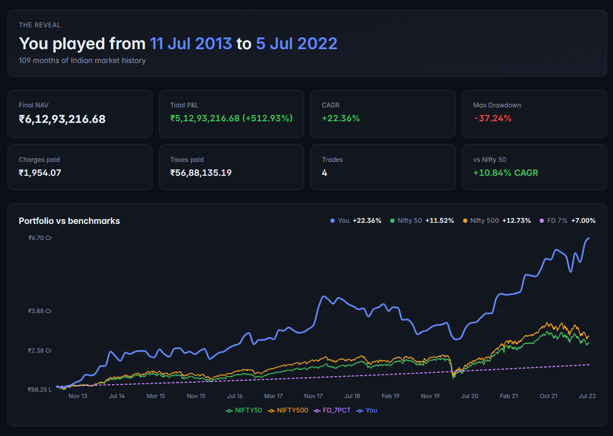

# Market Simulation — Learn the Indian market by living inside one

A turn-based investing game. You start with **₹1,00,00,000** and a **random,
hidden slice of Indian market history** (somewhere between 2010 and today,
1–10 years long). You trade Nifty 500 stocks and top mutual funds. You never
see the calendar dates during play — only trailing prices, sectors, and
fundamentals. The period is revealed only when the game ends.

- Stack: **FastAPI + SQLite + yfinance + mfapi.in** · **React + Vite + TS + Tailwind + Recharts**
- Full Indian market frictions: brokerage, STT, exchange, SEBI, stamp duty, GST, DP, STCG/LTCG
- Local-only, no login, single user


-- 



## Project layout

```
market_simulation/
├── backend/              FastAPI app (managed by uv)
│   ├── app/
│   └── pyproject.toml
├── frontend/             Vite + React + TS UI
├── docs/
│   └── ind_nifty500list.csv   (stock universe)
├── plan.md               design document
└── README.md
```

## One-time setup

### 1. Prerequisites
- Python 3.11+
- [uv](https://docs.astral.sh/uv/) (`pip install uv` or `winget install astral-sh.uv`)
- Node.js 20+

### 2. Backend — install + download market data

```bash
cd backend
uv sync                                         # install dependencies
uv run python -m app.ingest.fetch_stocks        # one-time, ~15-25 min (needs internet)
uv run python -m app.ingest.fetch_mf_master     # ~10 sec, prefetches MF master list
```

The ingest script downloads adjusted close prices for every Nifty 500 symbol
plus the NIFTY 50 and NIFTY 500 indices from 2008-01-01 to today, and caches
them in `backend/data/market.sqlite`. It is idempotent — re-running only fetches
new data.

### 3. Frontend

```bash
cd frontend
npm install
```

## Run it

Open two terminals.

**Terminal 1 — backend:**
```bash
cd backend
uv run uvicorn app.main:app --reload --port 8000
```

**Terminal 2 — frontend:**
```bash
cd frontend
npm run dev
```

Open **http://localhost:5173**.

## How to play

1. Pick a step size (day / week / month) on the home page and click **Begin**.
2. Browse Stocks or Mutual Funds. Every price series is shown as `t-N … t0` —
   calendar dates are hidden.
3. Click any instrument to see its trailing chart + fundamentals. Click
   **Buy / Sell** to place a market-at-close order. The order dialog shows
   estimated charges; the server returns the exact breakdown.
4. Click **Next** to advance one step. Prices, sectors, and your holdings
   update.
5. The game ends randomly somewhere between 1 and 10 years — you won't know
   when. On end, the period is revealed and your portfolio is compared against
   Nifty 50, Nifty 500, and a 7% fixed deposit.
6. **History** lists every completed run.

## What's simulated

| Feature                | How |
|---|---|
| Stock universe         | Nifty 500 (from `docs/ind_nifty500list.csv`) — current constituents applied across history. Mild survivorship bias. |
| MF universe            | ~200 curated **Direct-Growth** schemes from top AMCs, across categories (index, large/mid/small/flexi/ELSS/hybrid/debt). |
| Prices                 | yfinance **adjusted close** — corporate actions (dividends, splits, bonus) baked in. |
| MF NAV                 | mfapi.in, lazy-cached per-scheme. |
| Orders                 | Market-at-turn-close only. No short selling. Whole shares for stocks; fractional units for MFs. |
| Charges                | Brokerage (₹20 cap), STT, NSE exchange, SEBI, stamp duty, GST, DP (₹15.93 per sell day). |
| Taxes                  | STCG 15%, LTCG 10% above ₹1L exemption — applied once at game end, including mark-to-market of unclosed holdings. |
| Benchmarks             | Nifty 50, Nifty 500, FD @ 7% p.a. daily-compounded. |
| Time masking           | Enforced centrally in `app.core.time_masking.mask_series` and the API layer — frontend never sees dates during play. |

## Known limitations

- **Survivorship bias**: the tradable universe is today's Nifty 500 across all
  historical periods. Acceptable for teaching; flagged in the Results screen.
- **Historical fundamentals**: yfinance reliably exposes only current snapshots
  of P/E, P/B, EPS. Point-in-time values during old games are approximations.
- **MF taxation**: all MFs are taxed as equity for simplicity. A production
  system would branch on scheme category.
- **IPO gaps**: if a stock's listing post-dates your game's hidden start, its
  chart will simply be shorter — no special handling beyond that.

## Reset

To start fresh, delete `backend/data/market.sqlite` and re-run the ingest
script. (Past games are also wiped.)

## License

For educational use. Not investment advice.
